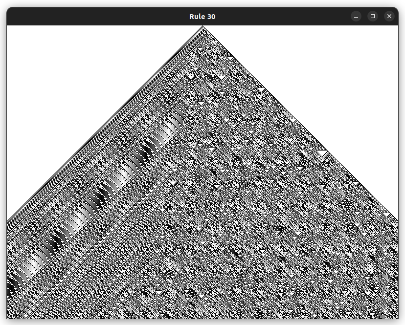
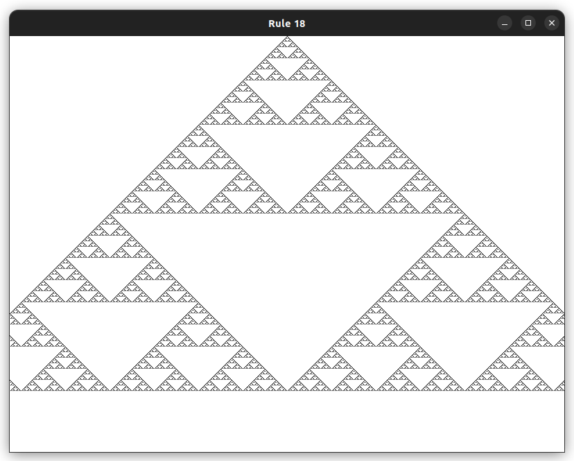
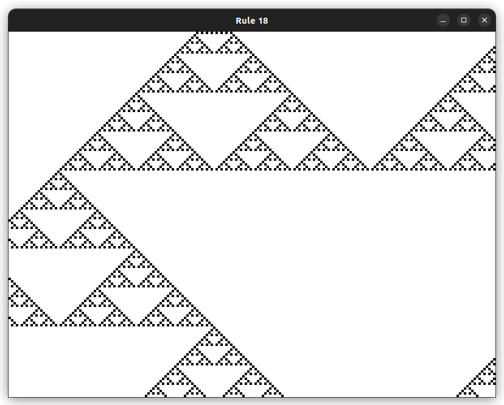
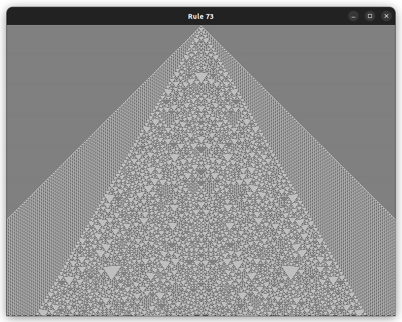

# CellAuto
Implementation of Elementary Cellular Automaton popularized by Stephen Wolfram in SDL2 and C. Allows interacting with the image produced by the rule.

For more information about elementary cellular automata, please see the wikipedia page: https://en.wikipedia.org/wiki/Elementary_cellular_automaton




# Requirements and installation
Please make sure the header files of the SDL2-Library are installed on your machine. Compile the program by typing ```make```. Uses gcc for compilation.  
Afterwards start the program by typing ```./CellAuto```  
The program will then ask you for input of an integer of a rule. It allows input from 0-255.
Alternatively you can provide the rule as an argument with the program call: ```./CellAuto 30```

# Small selection of pictures


  

  
